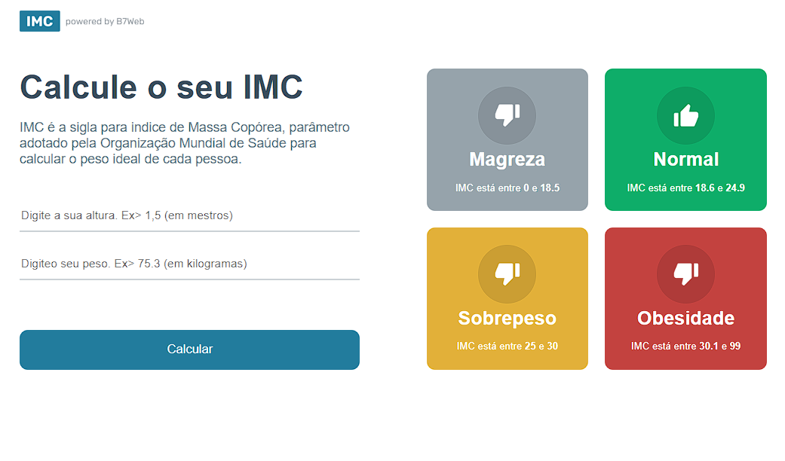
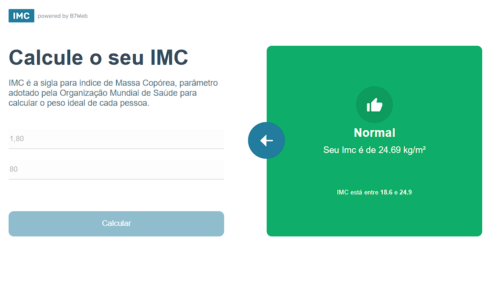

# IMC Calculator

Projeto em React + Typescript fazendo uma calculadora de IMC.
Índice de Massa Corpórea.

Projeto desenvolvido durante o treinamento da plataforma, totalmento responsivo e funcional. 
<a href="https://b7web.com.br">B7Web</a>

Irei adicionando links.

Tela inicial.

Tela após o cálculo realizado. Ex: 180 de altura e 80 kg

